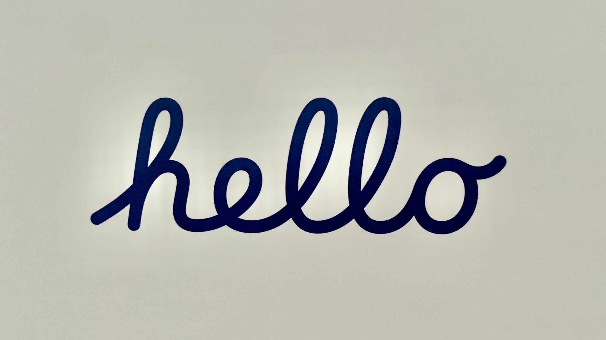

ブログをまた新しく始めてみました。

もともとはGatsbyとHeadless CMSを組み合わせてブログを作りたかったのですが、Gatsby Imageとブログの投稿の画像をうまく紐付けることができなかったのでしばらく諦めていました。
それからどんどんブログを書くことも億劫になってしまいました。

これからは初心に返ってしばらくはMarkdownとGitの組み合わせでブログを続けていこうと思います。

当初はRailsを題材にするつもりだったのですが、6月20日に思い切ってiMacを購入したのでXcodeを始めてみたいと思いました。
Swiftでもプログラムを書いたことがあったのですが、ほとんど忘れてしまったのでとても新鮮な気持ちです。

週末に少しずつ続けているのでまだ書籍の1/3くらいまでしか進んでいませんが、早くもいろいろ作れそうな気持ちになっています。
UIKitの頃と比べるとコードがすっきりしているので、ずいぶん作りやすくなった印象です。
