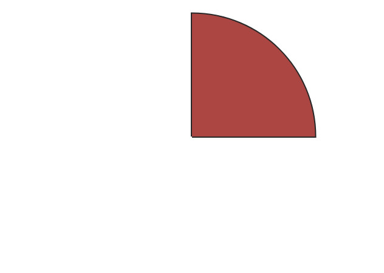

今回はpie chart(円グラフ)の作り方を覚えたので、その復習をしてみようというのが趣旨です。

この手のライブラリは豊富にあるし、pie chartを自分で描きたいと考えたことはありません。
もし自分で描くとするならきっとそれなりにコード量が多いのかなと思っていました。

まずは純粋に人間がpie chartを描くときは以下のステップを踏むでしょう:

1. 円を描く
2. 円の12時と円の中心を線でつなぐ
3. 円の中心からおおよその割合(1/12=10%)に分けて線を引く
4. 項目が2つ以上ある場合3を繰り返す

この動作をプログラムで再現するのは円周上の*x*と*y*の座標を計算しなければならないです。
プログラムで表現する場合は考え方を変えるともっと簡単に表現することができます。

それは「**弧を描く**」と「**パスの終端を円の中心で結ぶ**」です。

今回はCanvasとJavaScriptで再現してみます:

```javascript
const canvas = document.getElementById("figure-1")
const ctx = canvas.getContext("2d")

const x = canvas.width / 2     // x座標の中心
const y = canvas.height / 2    // y座標の中心

ctx.strokeStyle = "#282828"
ctx.lineWidth = 4

ctx.fillStyle = "#ab4642"

ctx.beginPath()
ctx.moveTo(x, y)
ctx.arc(x, y,
        Math.min(x, y) * 0.9, // 半径
        Math.PI * -0.5,       // 90°
        Math.PI * 0,          // 180°
        false)                // 時計回り
ctx.lineTo(x, y)
ctx.stroke()
ctx.fill()
```

このコードを実行すると以下の画像が生成されました:



Canvasの場合は`moveTo`と`lineTo`というメソッドが必要でしたが、扇形の図形が出力されました。
あとはこれを円の形になるまで繰り返せばよいです。

```javascript
const canvas = document.getElementById("figure-1")
const ctx = canvas.getContext("2d")

const colors = ["#ab4642", "#f7ca88", "#86c1b9", "#ba8baf"]
const data = [40, 27, 23, 10]

const x = canvas.width / 2
const y = canvas.height / 2

ctx.strokeStyle = "#282828"
ctx.lineWidth = 4

let start = 0
let end = 0

for (let i = 0; i < data.length; i++) {
  end += data[i]

  ctx.fillStyle = colors[i]

  ctx.beginPath()
  ctx.moveTo(x, y)
  ctx.arc(x, y,
          Math.min(x, y) * 0.9,
          Math.PI * (start / 50 - 0.5),
          Math.PI * (end / 50 - 0.5),
          false)
  ctx.lineTo(x, y)
  ctx.stroke()
  ctx.fill()

  start += data[i]
}
```

このコードを実行すると以下の画像が生成されました:


今でこそExcelなどを使えばすぐにpie chartを作ることはできますが、こうしてJavaScriptで描いてみるのもそんなに難しくなかったです。
