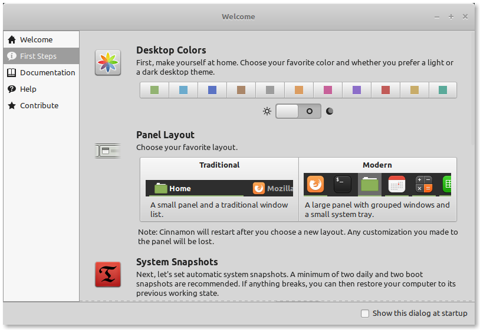
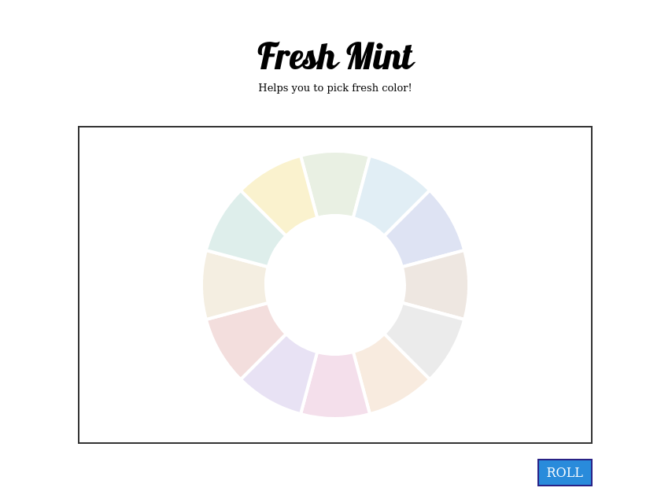
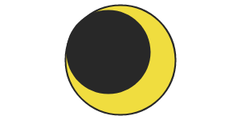

気がつけば8月も過ぎて9月に突入してしまいました。
相変わらずブログに書くネタも特にないのですが、最近PCの調子が悪くなってしまいOSを入れ直しました。



[Linux Mint](https://www.linuxmint.com/)を使っているので初回起動時に**mintwelcome**というプログラムが起動するのですが、ここでデスクトップのテーマ色を決めることができるわけです。
そこまで頻繁でもないですが不調時はOSごと再インストールしたり、最近では仕事用に専用のユーザーアカウントを作ることもあるのでデフォルトの緑だけだと面白みがありません。
今まではなんとなくフィーリングで色を選んでみたりもしたのですが、せっかくなので自動で選んでくれるプログラムがあったらいいなと思いました。

[](https://nzwsch.github.io/freshmint/)

だいたい不発に終わることも多いのですが、今回は「[**Fresh Mint**](https://nzwsch.github.io/freshmint/)」というページをリリースするまでに至りました。
機能自体は「**ROLL**」ボタンをクリックすると、ルーレットが回ってデスクトップの色を選んでくれます。
今回うまくできた機能としては**donut chart**と**アニメーションの連結**です。

### donut chart

[pie chartの作り方](/blog/20210711/)を以前作っていたので今回はその応用です。
最初は弧を2重に描く方法を考えていたのですが、うまくできませんでした。
StackOverflowに[How to draw doughnut with HTML5 canvas](https://stackoverflow.com/a/15908098)という回答を要約すると、**pie chartを作ったあとに小さいpie chartをくり抜けばよい**とのことでした。
今回に限ったことではないのですが見方を変えるだけで簡単な方法はいくらでも見つかるわけだから、こういった意識は参考にしていきたいと思いました。



おまけですが、今回たまたま月のシルエットも作ることができました。
これも中心からずらすだけだったので実装自体は簡単です。
他にも2つ並べればマウスカーソルを追いかける[Googly Eyes](https://duckduckgo.com/?q=googly+eyes)も作れそうな気がします。

```javascript
const canvas = document.getElementById("figure-3")
const ctx = canvas.getContext("2d")

const x = canvas.width / 2
const y = canvas.height / 2

ctx.strokeStyle = "#282828"
ctx.lineWidth = 4

ctx.fillStyle = "#f0dd3f"

// 黄色い円
ctx.beginPath()
ctx.moveTo(x, y)
ctx.arc(x, y, Math.min(x, y) * 0.9, 0, Math.PI * 2, false)
ctx.lineTo(x, y)
ctx.stroke()
ctx.fill()

ctx.fillStyle = "#282828"

// 黒い円
ctx.beginPath()
ctx.moveTo(x-50, y-50)
ctx.arc(x-15, y-10, Math.min(x, y) * 0.7, 0, Math.PI * 2, false)
ctx.lineTo(x-50, y-50)
ctx.fill()
```

### アニメーションの連結

HTML5のCanvasを使ってプログラムを書くことは今までも何回かありましたが、2つのアニメーションを組み合わせるのが苦手でした。
例えば将棋やブラックジャックのようなゲームを書いた時は駒やカードを動かしたいと思うわけですが、あらかじめ決められた座標へ移動するイベントを作ることがなかなか実現できませんでした。
CSSトランジションのイベントリスナーを作ろうとしたとき、アニメーションの最中に座標の移動が完了してしまったりして完成度を高めることができずにいました。

今回もボタンをクリックするとボタンが押せなくなり、ルーレットのアニメーションが開始、完了時に点滅、それから再びボタンを押せるようになるというアクションが必要でした。
こういう時のためにReactであったりVueを使えばよいのかもしれませんが、もともとはここまで書くつもりもなかったので今回はそういったライブラリを使おうとは思いませんでした。
それではどうやって実装できたのかというと、単純に**Promise**を使いました。


```javascript
const rouletteAnimation = () =>
  new Promise(done => {
    let count = 0

    console.log("roulette start", count)

    setTimeout(() => {
      console.log("roulette end", ++count)
      done(count)
    }, 1000)
  })

const blinkAnimation = count =>
  new Promise(done => {
    console.log("blink start", count)

    setTimeout(() => {
      console.log("blink end", ++count)
      done()
    }, 1000)
  })

console.log("animation start")
rouletteAnimation()
  .then(count => blinkAnimation(count))
  .then(() => console.log("animation end"))
```

特にこれといって新しいことはしていないのですが、意外とこの仕組みを理解できていないと簡潔なプログラムは書けない気がします。

    animation start
    roulette start 0
    roulette end 1
    blink start 1
    blink end 2
    animation end

今回だと`count`変数は表示する色のインデックスを渡しています。
グローバル変数でも同様のことはできるのですが、なるべくスコープの中に閉じ込めたいですよね。
もちろんイベントでも同様のことはできたはずなのですが、**Promise**の方が直感的にわかりやすいコードを書くことができました。

休みをほぼ丸1日使ってしまいましたが、たまにこうしてちょっとしたプログラムを書くのも気分転換に良い気がしました。
