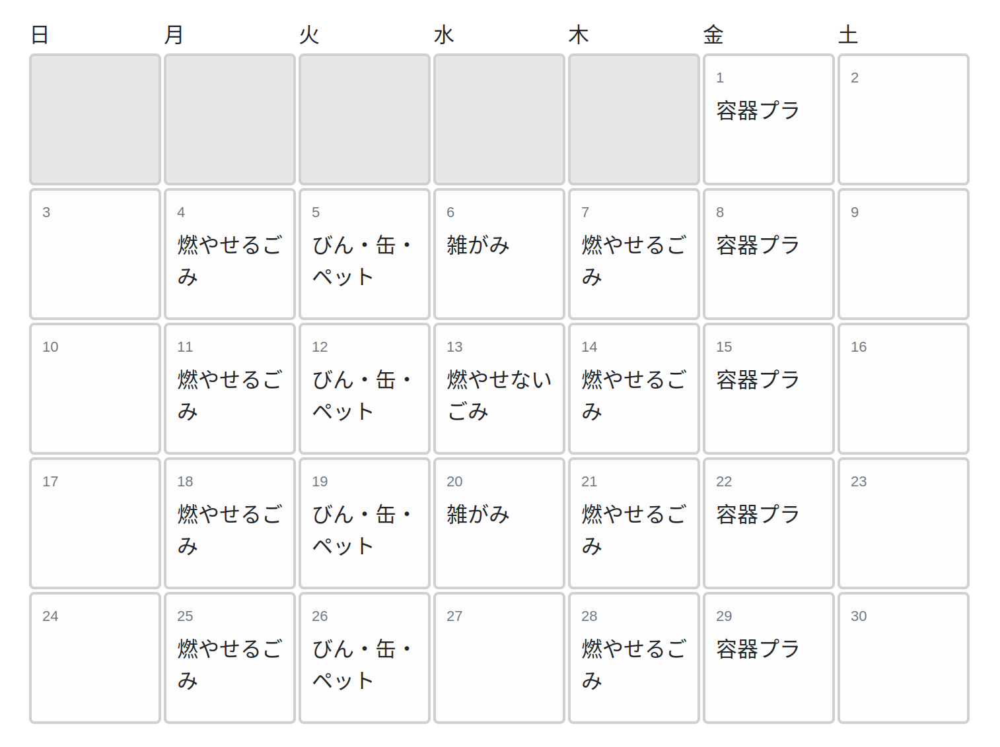

[前回の投稿](/blog/20220520/)で作っていたごみ収集日のアプリケーションを無事リリースできました。

[Gominohi](https://github.com/nzwsch/gominohi)

機能のひとつに月のカレンダーからごみ収集日の一覧を表示する機能を作ったのですが、なるべく外部のライブラリに依存しない仕組みにしたかったのでJSで利用できるカレンダー等は使っていません。

しかしいざゼロからカレンダーを作ろうとどうすればいいんだと思いませんか？



まずは一週間の曜日を並べるだけなら誰でもできそうですが、この画像で表示したように月の最初が必ず日曜日から始まるとは限らないのです。

それではどうやってその月のはじめの曜日を調べられるのかというと[ツェラーの公式][zellers-congruence]という計算式を使えばよいです。

数学的な解説は省きますが、[こちらのコード][zellers-algorithm]を拝借しました:

```cpp
/*================ FUNCTION TO CALCULATE ZELLER'S ALGORITHM =============*/
int getZeller(int Month,int Year)
{
    int Day = 1, ZMonth, ZYear, Zeller;
    if(Month < 3)
        ZMonth = Month+10;
    else
        ZMonth = Month-2;
    if(ZMonth > 10)
        ZYear = Year-1;
    else
        ZYear = Year;
    Zeller = ((int)((13*ZMonth-1)/5)+Day+ZYear%100+
            (int)((ZYear%100)/4)-2*(int)(ZYear/100)+
            (int)(ZYear/400)+77)%7;
    return Zeller;
}
```

`Month`(月)と`Year`(年)を引数にとって、`0`から`6`の`Zeller`という整数を返します。

これで開始の日付がわかったので`for`文で`Zeller`の値分シフトしてあげればよいわけです。

```ruby
calendar     = []
calendar_row = []

puts %w[日 月 火 水 木 金 土].join(' ')

(7*5).times do |i|
  # end_of_monthは28,30,31のいずれかが入る
  if i >= zeller && i - zeller < end_of_month
    calendar_row << i - zeller + 1
  else
    calendar_row << '_'
  end

  # 7日分で改行する
  if i > 0 && (i + 1) % 7 == 0
    calendar << calendar_row.join(' ')
    calendar_row = []
  end
end

puts calendar.join("\n")
```

`zeller = 5, end_of_month = 30`の出力例がこちら:

```
日 月 火 水 木 金 土
_ _ _ _ _ 1 2
3 4 5 6 7 8 9
10 11 12 13 14 15 16
17 18 19 20 21 22 23
24 25 26 27 28 29 30
```

ただし上記コードの注意点としてカレンダーは土曜日が開始日などの場合は**5行分ではなく6行分表示するとき**も考慮しなければなりません。

```ruby
calendar     = []
calendar_row = []

puts %w[日 月 火 水 木 金 土].join(' ')

(7*6).times do |i|
  # 5行分ですべて表示したら6行分はスキップする
  break if zeller + end_of_month <= 35 && i >= 35

  # end_of_monthは28,30,31のいずれかが入る
  if i >= zeller && i - zeller < end_of_month
    calendar_row << i - zeller + 1
  else
    calendar_row << '_'
  end

  # 7日分で改行する
  if i > 0 && (i + 1) % 7 == 0
    calendar << calendar_row.join(' ')
    calendar_row = []
  end
end

puts calendar.join("\n")
```

`zeller = 6, end_of_month = 31`の出力例がこちら:

```
日 月 火 水 木 金 土
_ _ _ _ _ _ 1
2 3 4 5 6 7 8
9 10 11 12 13 14 15
16 17 18 19 20 21 22
23 24 25 26 27 28 29
30 31 _ _ _ _ _
```

実際のコードと比べるとかなり簡略化していますが、必要な箇所はこれだけなので他の言語でも実装できると思います。
サーバー側の実装はできたので、ブラウザ以外でも使えるような実装にしてスマートフォンなどで表示できるようにしたいです。

[zellers-congruence]: https://en.wikipedia.org/wiki/Zeller%27s_congruence
[zellers-algorithm]: https://www.codeproject.com/articles/783307/calendar-using-c-programming-language
